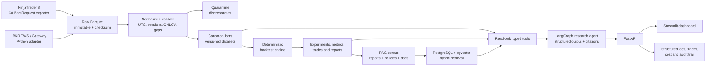

# Propuesta de Proyecto Final: TradeLab AI

## 1. Resumen ejecutivo

**TradeLab AI** será una plataforma auditable de investigación cuantitativa y análisis de riesgo para futuros micro de índices. Ingerirá histórico de mercado desde **NinjaTrader 8** e **Interactive Brokers (IBKR)**, normalizará y reconciliará ambas fuentes, ejecutará backtests deterministas y permitirá consultar los resultados mediante un copiloto de IA con RAG, herramientas tipadas y citas verificables.

El proyecto demostrará ingeniería de IA aplicada a un dominio financiero real. No será un “bot que adivina el mercado” ni enviará órdenes reales. Su producto principal será un flujo profesional y reproducible:

1. descargar datos;
2. validar su calidad y procedencia;
3. ejecutar una estrategia parametrizada sin sesgos evidentes;
4. evaluar robustez y riesgo;
5. explicar cada resultado con evidencias recuperables.

**Fecha objetivo de entrega:** 3 de septiembre de 2026.

**Esfuerzo previsto:** 10-14 horas semanales durante 6 semanas y media, aproximadamente 80 horas.

## 2. Por qué este alcance es adecuado

El enunciado exige un sistema completo con datos reales, FastAPI, CAG/RAG, al menos un agente con function calling, evals y evidencia de despliegue. TradeLab AI cubre todos esos componentes sin hacer depender la nota de que una estrategia sea rentable.

La calidad del proyecto se medirá por reproducibilidad, integridad del dato, ausencia de fugas temporales, trazabilidad, evaluación de la IA y funcionamiento del producto. La rentabilidad será un resultado experimental, no una promesa ni un criterio de aprobación.

## 3. Alcance funcional

### 3.1 MVP obligatorio

- Instrumentos: **MES y MNQ**.
- Frecuencia: barras de **5 minutos**.
- Histórico objetivo: entre 12 y 24 meses, según disponibilidad y permisos comprobados en el spike inicial.
- Contratos: vencimientos explícitos, sin confiar inicialmente en símbolos continuos construidos de forma distinta por cada proveedor.
- Fuentes:
  - NinjaTrader 8: exportador local C# basado en NinjaScript/`BarsRequest`.
  - IBKR: conector Python contra TWS o IB Gateway mediante la TWS API.
- Almacenamiento:
  - ficheros raw inmutables en Parquet;
  - catálogo, linaje, resultados y corpus RAG en PostgreSQL;
  - pgvector para documentos y chunks.
- Validación y reconciliación de OHLCV.
- Una estrategia determinista: **Opening Range Breakout intradía con filtro ATR**, stop, objetivo, salida horaria y máximo de una entrada por sesión.
- Backtesting con comisión, slippage y tamaño de tick configurables.
- Separación temporal train/validation/holdout y walk-forward básico.
- Copiloto que consulta datos, lanza backtests permitidos y explica resultados con fuentes.
- Frontend Streamlit y API FastAPI.
- Tests, evals, observabilidad, Docker Compose y CI básica.
- Demo pública con datos permitidos/preparados o vídeo de 2-3 minutos.

### 3.2 Fuera del MVP

- Trading con dinero real.
- Ejecución automática de órdenes.
- Alta frecuencia, order book completo o reconstrucción tick a tick.
- Predicción de precios mediante LLM.
- Optimización masiva de cientos de parámetros.
- Más de una familia de estrategias.
- Aplicación móvil, multiusuario empresarial o alta disponibilidad.
- Multiagente complejo salvo que el MVP esté terminado y medido.

### 3.3 Mejoras opcionales

- Paper trading/replay con aprobación humana.
- Agente crítico de riesgo que revise el informe del agente investigador.
- Comparación con una segunda estrategia de referencia muy simple.
- Cache exacta de consultas y streaming SSE.
- Despliegue gestionado completo en lugar de vídeo.

## 4. Pregunta de producto

> ¿Puede un investigador cargar histórico de dos brokers, saber si los datos son fiables, ejecutar un experimento reproducible y obtener una explicación auditada de los resultados sin escribir código ni aceptar cifras inventadas por un LLM?

Usuarios objetivo: trader sistemático individual, analista cuantitativo junior o responsable de riesgo que necesita revisar experimentos.

## 5. Arquitectura



### 5.1 Decisiones técnicas clave

1. **El dato numérico no se guarda como embeddings.** Las barras, operaciones y métricas se consultan con SQL/Python determinista. Los embeddings se reservan para documentos, políticas, informes y diario de experimentos.
2. **El LLM no calcula métricas financieras.** Sharpe, drawdown, P&L, tamaño de posición y comparaciones se calculan en código probado; el LLM recibe resultados estructurados.
3. **CAG para conocimiento pequeño y estable.** Definiciones de métricas, esquema de salida, límites del agente y política de riesgo estarán versionados en prompts Jinja2.
4. **RAG para conocimiento grande o cambiante.** Informes de calidad, fichas de experimentos, documentación de brokers, especificaciones de estrategia y decisiones técnicas se indexarán con chunks contextuales.
5. **Pipeline por defecto, agente cuando aporta decisión.** Descarga, validación y backtesting son workflows deterministas. El agente solo interpreta intención, selecciona herramientas y sintetiza evidencias.
6. **Datos raw inmutables y datasets versionados.** Cada ejecución registra fuente, request, zona horaria, sesión, checksum, versión de normalizador y fecha de ingesta.
7. **Sin credenciales en cloud.** Los conectores de broker se ejecutan localmente. La demo pública consume un snapshot aprobado o únicamente resultados derivados.

## 6. Diseño de la ingesta

### 6.1 Contrato canónico de barra

Campos mínimos:

`source`, `instrument`, `contract_month`, `exchange`, `bar_size`, `timestamp_utc`, `session_date`, `open`, `high`, `low`, `close`, `volume`, `trade_count`, `wap`, `rth`, `timezone_original`, `ingestion_run_id`, `raw_checksum`.

Restricciones:

- clave única por fuente, contrato, timeframe y timestamp;
- precios positivos y alineados con tick size;
- `low <= open/close <= high`;
- timestamps monótonos, normalizados a UTC;
- duplicados igual a cero tras normalización;
- gaps clasificados como sesión cerrada, mantenimiento, dato no disponible o error;
- nunca mezclar silenciosamente barras contradictorias.

### 6.2 NinjaTrader

Se creará un Add-On/exportador pequeño en C# que reciba instrumento, contrato, fechas, bar size y plantilla de sesión; solicite barras con `BarsRequest`; y genere un fichero raw acompañado de un manifiesto JSON. Si el desarrollo del Add-On bloquea el calendario, el fallback aceptable para la primera iteración será exportar desde NinjaTrader y pasar el fichero por el mismo contrato de ingesta.

### 6.3 Interactive Brokers

El adapter Python solicitará histórico mediante `reqHistoricalData`, paginará por ventanas compatibles con duración/granularidad, respetará pacing y reintentará errores transitorios con backoff. Guardará también los parámetros `whatToShow`, `useRTH`, zona horaria y contrato resuelto.

La disponibilidad depende de permisos de mercado y del histórico que IBKR mantenga. El spike de la primera semana debe confirmar que la cuenta devuelve MES/MNQ de 5 minutos para el periodo elegido antes de construir el resto.

### 6.4 Reconciliación

Para timestamps presentes en ambas fuentes:

- comparar OHLC contra la tolerancia del tick;
- comparar volumen como diferencia relativa informativa, porque los proveedores pueden filtrar o construir el dato de forma distinta;
- producir cobertura común, missing rate, discrepancias por campo y periodos problemáticos;
- establecer una fuente preferida configurable, conservando siempre ambos originales;
- enviar discrepancias a cuarentena y generar un informe versionado que el RAG pueda citar.

## 7. Estrategia y backtesting

La estrategia MVP será deliberadamente comprensible y con pocos grados de libertad:

- calcula el rango de apertura de los primeros 15 o 30 minutos;
- solo permite una ruptura por sesión;
- filtro de volatilidad ATR calculado únicamente con datos anteriores;
- stop y target expresados en múltiplos de riesgo;
- salida obligatoria antes del cierre;
- máximo una operación al día;
- comisión, slippage y multiplicador del contrato explícitos.

### 7.1 Protección contra resultados engañosos

- split temporal, nunca aleatorio;
- todos los indicadores desplazados para impedir look-ahead;
- parámetros elegidos en train, decisión en validation y una única lectura final del holdout;
- walk-forward con ventanas registradas;
- benchmark simple y resultado buy/hold o sesión equivalente cuando tenga sentido;
- métricas por año, contrato, sesión y régimen, no solo agregado;
- sensibilidad a costes y parámetros cercanos;
- semilla fija donde exista aleatoriedad;
- hash del dataset, código, parámetros y prompt en cada experimento.

### 7.2 Métricas

Retorno neto, CAGR cuando sea aplicable, volatilidad, Sharpe/Sortino con convención documentada, máximo drawdown, Calmar, profit factor, win rate, expectancy, número de operaciones, exposición, turnover y sensibilidad a slippage.

No se fijará como criterio “Sharpe > X” para aprobar el proyecto. Sí se exigirá que ninguna métrica pueda aparecer sin trazabilidad al experimento que la generó.

## 8. Capa de IA

### 8.1 Herramientas tipadas

- `get_dataset_quality(dataset_id)`
- `compare_sources(instrument, start, end)`
- `run_backtest(strategy_id, dataset_id, allowed_parameters)`
- `get_experiment_metrics(experiment_id)`
- `get_trade_sample(experiment_id, filters)`
- `search_research_documents(query, filters)`
- `generate_experiment_report(experiment_id)`

Las herramientas validarán permisos y parámetros fuera del prompt. No existirá ninguna tool de envío de órdenes.

### 8.2 Flujo del agente

1. clasificar la petición mediante reglas y, si es ambigua, mediante decisión estructurada del LLM;
2. comprobar precondiciones deterministas;
3. recuperar documentos y/o invocar tools numéricas;
4. generar una respuesta Pydantic con `answer`, `metrics`, `assumptions`, `warnings`, `sources` y `confidence`;
5. verificar que cada cifra y cita existe en los resultados de tools;
6. pedir aclaración o responder “evidencia insuficiente” cuando corresponda.

El estado mínimo se persistirá con checkpointer y un `analysis_id` común enlazará conversación, experimento, trazas y auditoría.

### 8.3 Corpus RAG

- especificación de la estrategia;
- política de riesgo y glosario;
- documentación relevante de APIs y limitaciones de datos;
- informes de calidad y reconciliación;
- informes de cada experimento;
- diario de decisiones técnicas;
- catálogo de datasets.

Se usarán chunks contextuales, metadata tipada, búsqueda híbrida vectorial + full-text, filtros por instrumento/fecha/tipo y citas verificables hasta el documento original.

## 9. Evals y criterios de aceptación

### 9.1 Datos y quant

- 100% de ficheros raw con manifiesto y checksum.
- Cero duplicados en el dataset canónico.
- 100% de gaps clasificados o reportados.
- Informe de reconciliación reproducible para ambos instrumentos.
- Test que falla si un indicador usa una barra futura.
- Misma entrada + misma versión = mismo resultado y mismo hash.
- Comisiones y slippage presentes en todas las métricas netas.
- Holdout no utilizado durante selección de parámetros.

### 9.2 IA

Golden dataset de 30-40 preguntas:

- tool selection accuracy >= 90%;
- schema validity = 100%;
- retrieval Recall@5 >= 85% sobre documentos anotados;
- citation precision >= 95%;
- cero IDs de fuente inexistentes;
- cero cifras financieras no presentes en una tool o fuente;
- faithfulness >= 0.90 en el conjunto evaluado;
- al menos un caso de regresión automatizado por cada fallo importante descubierto.

Se combinarán tests hard con pytest, métricas de retrieval y pocos casos LLM-as-judge documentados. Los thresholds podrán ajustarse una vez con el baseline inicial, dejando registro de la decisión.

### 9.3 Producto y producción

- el evaluador puede ejecutar el happy path sin credenciales de broker;
- API documentada con OpenAPI;
- dashboard muestra calidad, experimento, equity curve, drawdown, operaciones y respuesta citada;
- errores de broker, datos insuficientes y timeouts producen estados comprensibles;
- logs correlacionados, latencia, uso de tools, tokens y coste visibles;
- CI ejecuta lint, unit tests, integration tests sin broker y evals rápidas;
- secrets excluidos del repositorio y ejemplo `.env.example` incluido.

## 10. Plan calendario realista

### Fase 0 - 18 a 20 de julio: viabilidad y congelación de alcance (4-6 h)

- confirmar cuenta, permisos y descarga real de 2-5 días desde ambos brokers;
- fijar instrumentos, contratos, timeframe y sesiones;
- crear rama `finalproject-[iniciales]` y esqueleto del README;
- registrar riesgos de licencias de datos y decidir qué puede mostrarse públicamente.

**Gate:** no seguir sin dos muestras reales y contrato canónico aprobado. Si MES/MNQ falla en una fuente, reducir a un instrumento común que sí funcione.

### Fase 1 - 21 a 27 de julio: base técnica y contratos (10-12 h)

- monorepo Python/FastAPI con configuración, Pydantic, logging y Docker Compose;
- PostgreSQL + pgvector, migraciones y modelos de catálogo;
- esquema de barra, manifiesto de ingesta y validaciones Pandera;
- fixtures pequeños versionables y primeros tests.

**Entrega interna:** API `/health`, migraciones, catálogo y validación de un fixture.

### Fase 2 - 28 de julio a 3 de agosto: conectores y calidad (14-16 h)

- adapter IBKR con paginación, pacing, retry y persistencia raw;
- exportador NinjaTrader o fallback export-file formalizado;
- normalización de contratos, UTC, sesiones y tick size;
- reconciliación, cuarentena e informe de cobertura/discrepancias.

**Gate:** un instrumento y al menos tres meses de datos reconciliados end-to-end. El segundo instrumento solo entra después.

### Fase 3 - 4 a 10 de agosto: backtesting reproducible (12-14 h)

- motor de estrategia, fills, costes, métricas y persistencia de experimentos;
- tests anti-look-ahead y determinismo;
- split temporal, walk-forward y baseline;
- generación automática de informe Markdown/JSON.

**Gate:** un comando reproduce un experimento completo desde un `dataset_id` y deja hash, trades, métricas e informe.

### Fase 4 - 11 a 17 de agosto: CAG/RAG (10-12 h)

- catálogo documental, extracción, chunks contextuales y embeddings;
- pgvector HNSW más búsqueda full-text/híbrida;
- augmentation con XML/metadata, citas y política de evidencia insuficiente;
- golden set de retrieval inicial.

**Gate:** preguntas sobre calidad, estrategia y experimentos recuperan fuentes correctas con Recall@5 medido.

### Fase 5 - 18 a 24 de agosto: agente y producto (12-14 h)

- tools tipadas y LangGraph con estado/checkpointer;
- verificador de cifras y fuentes;
- guardrails, límites de pasos y auditoría;
- Streamlit con wizard: dataset -> estrategia -> backtest -> análisis citado.

**Gate:** happy path completo desde la UI, sin acceso directo del LLM a SQL ni al broker.

### Fase 6 - 25 a 30 de agosto: evals y producción (10-12 h)

- completar 30-40 casos golden y caso de regresión;
- observabilidad, coste, errores y pruebas de seguridad;
- CI/CD, imagen Docker y despliegue de demo o entorno reproducible;
- prueba limpia siguiendo únicamente el README.

**Gate:** matriz de evaluación publicada y todos los obligatorios del máster cubiertos.

### Fase 7 - 31 de agosto a 3 de septiembre: buffer y entrega (8-10 h)

- corregir solo defectos; no añadir features;
- cerrar README, diagrama, ADRs, limitaciones y próximos pasos;
- grabar vídeo de 2-3 minutos aunque exista URL pública;
- crear release `v1.0-final-[iniciales]` y verificar acceso del TA;
- enviar URL exacta de la rama final por el canal confirmado.

## 11. Priorización si el calendario se complica

Orden de sacrificio:

1. eliminar segundo instrumento;
2. usar export de NinjaTrader reproducible en vez de Add-On completo;
3. eliminar agente crítico y mantener un solo agente;
4. eliminar Redis, SSE y optimizaciones avanzadas;
5. usar vídeo + Docker local en vez de resolver conectividad de brokers en cloud.

Nunca se recortan: calidad y linaje de datos, backtest determinista, RAG real, una capa de agente, evals, README y demo comprobable.

## 12. Estructura propuesta del repositorio

```text
tradelab-ai/
├── apps/
│   ├── api/
│   └── ui/
├── connectors/
│   ├── ibkr/
│   └── ninjatrader-csharp/
├── src/tradelab/
│   ├── ingestion/
│   ├── quality/
│   ├── datasets/
│   ├── backtesting/
│   ├── rag/
│   ├── agents/
│   ├── prompts/
│   └── observability/
├── migrations/
├── data_catalog/
├── evals/
│   ├── golden/
│   └── regression/
├── tests/
├── docs/
│   ├── architecture/
│   ├── adr/
│   └── demo/
├── docker-compose.yml
├── .env.example
└── README.md
```

## 13. Riesgos y mitigaciones

| Riesgo | Probabilidad/impacto | Mitigación |
|---|---|---|
| Sin permisos o histórico común | Alta/Alta | Spike en 48 h, un solo instrumento, periodo menor o dataset ya descargado y autorizado |
| Diferencias de sesiones/timezone | Alta/Alta | UTC canónico, calendario explícito, contrato por vencimiento y tests DST |
| Pacing/desconexiones IBKR | Media/Media | Ventanas pequeñas, cola, backoff, resume y checkpoints |
| Exportador NinjaTrader consume demasiado | Media/Alta | Fallback a export manual con manifiesto y pipeline idéntico |
| Sobreajuste de estrategia | Alta/Alta | Pocos parámetros, walk-forward, holdout bloqueado y sensibilidad |
| LLM inventa cifras | Media/Alta | Cálculo fuera del LLM, output tipado, verificador y citas obligatorias |
| Datos no redistribuibles | Media/Alta | Demo con muestra permitida/sintética o métricas derivadas; validar términos antes de publicar |
| Despliegue no conecta a brokers locales | Alta/Media | Ingesta local separada; cloud solo consulta snapshot preparado; vídeo obligatorio |
| Exceso de alcance | Alta/Alta | Gates semanales y orden de recorte definido |

## 14. Entregables alineados con la rúbrica

- **Arquitectura (25%):** diagrama, ADRs y justificación CAG -> RAG -> agente; separación offline/online y datos numéricos/documentales.
- **Funcionalidad (25%):** flujo completo probado con datos reales y demo reproducible.
- **Calidad IA (20%):** prompts versionados, schemas, guardrails, golden set, retrieval/citation/faithfulness y regresiones.
- **Producción (20%):** Docker, manejo de errores, trazas, costes, secrets, CI/CD y URL o vídeo.
- **Documentación (10%):** README como guía de producto, instalación, decisiones, limitaciones, resultados y próximos pasos.

## 15. Guion de la demo de 2-3 minutos

1. Mostrar el catálogo con dos fuentes y el informe de reconciliación.
2. Seleccionar dataset y lanzar el backtest ORB con parámetros permitidos.
3. Mostrar equity curve, drawdown, costes y hash del experimento.
4. Preguntar: “¿Por qué el resultado de validación es peor que train y qué evidencia lo demuestra?”.
5. Mostrar tools invocadas, respuesta estructurada y citas navegables.
6. Enseñar evals/CI en verde y explicar claramente que no existe ejecución real de órdenes.

## 16. Referencias operativas verificadas

- NinjaTrader documenta `BarsRequest` dentro de su Desktop SDK: https://developer.ninjatrader.com/docs/desktop/barsrequest
- IBKR documenta `reqHistoricalData`, duraciones, bar sizes y callbacks en IBKR Campus: https://ibkrcampus.com/campus/ibkr-api-page/twsapi-doc/
- La Web API de IBKR limita `/iserver/marketdata/history` a cinco peticiones concurrentes y requiere sesión/permisos apropiados: https://ibkrcampus.com/campus/ibkr-api-page/webapi-doc/

Estas referencias deben revisarse de nuevo al implementar, porque versiones, pacing, permisos y disponibilidad pueden cambiar.
