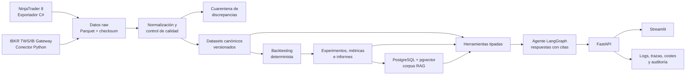

# Propuesta de Proyecto Final - Máster AI Engineering

## TradeLab AI: plataforma inteligente para investigación y evaluación de estrategias de trading

**Alumno:** CASILDO CAPARRÓS DÍAZ
**Iniciales para la rama final:** [TLAI]  
**Fecha:** 18 de julio de 2026  
**Fecha prevista de entrega:** 3 de septiembre de 2026

---

## 1. Resumen del proyecto

Mi Proyecto Final consistirá en desarrollar **TradeLab AI**, una plataforma profesional y auditable para la investigación de estrategias de trading.

El sistema descargará datos históricos de mercado desde **NinjaTrader 8** e **Interactive Brokers (IBKR)**, normalizará y comparará la información de ambos proveedores, ejecutará backtests reproducibles y permitirá analizar los resultados mediante un asistente de inteligencia artificial basado en **CAG, RAG, agentes y function calling**.

La finalidad del proyecto no será crear un sistema que prometa predecir el mercado ni realizar operaciones automáticas con dinero real. El objetivo será construir una herramienta de ingeniería que permita responder de forma fiable a preguntas como:

- ¿Son correctos y suficientemente completos los datos utilizados?
- ¿Qué diferencias existen entre los históricos de NinjaTrader e IBKR?
- ¿Cómo se comporta una estrategia dentro y fuera del periodo utilizado para configurarla?
- ¿Qué impacto tienen las comisiones y el slippage?
- ¿De dónde procede cada métrica o conclusión presentada por la IA?

El resultado será un producto funcional que combine ingeniería de datos, análisis cuantitativo e inteligencia artificial generativa con trazabilidad y evaluación objetiva.

## 2. Problema que se quiere resolver

El desarrollo de una estrategia de trading no depende únicamente de su lógica de entrada y salida. También depende de la calidad de los datos, del tratamiento de zonas horarias y sesiones, de la simulación de costes, de la prevención del sobreajuste y de la capacidad de reproducir los experimentos.

En un flujo de trabajo habitual, estos elementos suelen encontrarse separados:

- los datos se descargan desde diferentes plataformas;
- los backtests se ejecutan con configuraciones que no siempre quedan registradas;
- los resultados se analizan manualmente;
- las diferencias entre proveedores pueden pasar inadvertidas;
- una explicación generada por IA puede incluir cifras sin evidencia suficiente.

TradeLab AI centralizará este proceso y conservará el linaje completo desde el fichero descargado hasta el informe final. La IA actuará como interfaz de análisis y orquestación, mientras que los cálculos financieros permanecerán en código determinista y testeable.

## 3. Objetivos

### Objetivo general

Diseñar, implementar y desplegar un sistema de IA completo que permita investigar una estrategia de trading sobre datos históricos reales, con calidad de datos, backtesting reproducible, explicaciones fundamentadas y evaluación documentada.

### Objetivos específicos

1. Implementar conectores para obtener datos históricos desde NinjaTrader 8 e Interactive Brokers.
2. Crear un modelo canónico para normalizar instrumentos, contratos, timestamps, sesiones y barras OHLCV.
3. Validar duplicados, gaps, coherencia de precios y diferencias entre proveedores.
4. Versionar los datasets y conservar la procedencia de cada observación.
5. Implementar una estrategia de trading determinista y un motor de backtesting con costes reales configurables.
6. Aplicar separación temporal, holdout y walk-forward para reducir el riesgo de sobreajuste.
7. Construir un pipeline RAG sobre informes, políticas, documentación y resultados experimentales.
8. Desarrollar un agente con herramientas tipadas para consultar calidad, ejecutar experimentos permitidos y explicar resultados.
9. Incorporar guardrails que impidan inventar cifras, fuentes o conclusiones no respaldadas.
10. Evaluar el sistema mediante métricas cuantitativas, tests automáticos y un golden dataset de consultas.
11. Publicar una interfaz funcional y documentar su ejecución local o acceso a la demostración.

## 4. Alcance del MVP

Para mantener un alcance realista, la primera versión se centrará en:

- **Instrumentos:** futuros micro MES y MNQ.
- **Temporalidad:** barras de 5 minutos.
- **Histórico:** entre 12 y 24 meses, condicionado por los permisos y disponibilidad comprobados al comenzar.
- **Contratos:** vencimientos explícitos, evitando inicialmente depender de series continuas construidas de forma diferente por cada proveedor.
- **Estrategia:** Opening Range Breakout intradía con filtro de volatilidad ATR.
- **Gestión básica:** stop loss, objetivo, salida horaria y máximo de una entrada por sesión.
- **Costes:** comisión, slippage, multiplicador y tamaño de tick configurables.
- **Interfaz:** aplicación web desarrollada con Streamlit y backend FastAPI.
- **Ejecución:** investigación histórica exclusivamente, sin envío de órdenes reales.

Quedarán fuera del MVP el trading de alta frecuencia, el análisis completo del libro de órdenes, la optimización masiva, la ejecución automática y la incorporación de numerosas estrategias o mercados.

## 5. Arquitectura propuesta

### Componentes principales

1. **Ingesta offline:** descarga, almacenamiento raw, normalización, validación y versionado.
2. **Capa cuantitativa:** estrategia, simulación de operaciones, costes y cálculo de métricas.
3. **CAG:** definiciones estables, política de riesgo, esquema de salida y reglas del agente.
4. **RAG:** recuperación de informes de calidad, experimentos, documentación y decisiones técnicas.
5. **Agente:** selección de herramientas y síntesis de resultados mediante LangGraph y function calling.
6. **Servicio de producto:** API FastAPI, frontend Streamlit y persistencia en PostgreSQL/pgvector.
7. **Producción:** Docker, CI básica, observabilidad, control de errores, costes y secretos.

## 6. Aplicación de inteligencia artificial

La IA tendrá una función concreta y controlada. No se utilizará para calcular P&L, drawdown, Sharpe, señales o tamaños de posición. Estos cálculos se realizarán mediante código Python probado.

El agente podrá emplear herramientas como:

- consultar el informe de calidad de un dataset;
- comparar NinjaTrader e IBKR para un instrumento y periodo;
- ejecutar un backtest con parámetros permitidos;
- obtener las métricas y operaciones de un experimento;
- buscar documentación e informes mediante RAG;
- generar una explicación citada de los resultados.

Las respuestas utilizarán un esquema estructurado con conclusión, métricas, supuestos, advertencias, fuentes y nivel de confianza. Cada cifra financiera deberá proceder de una herramienta determinista y cada afirmación documental deberá estar asociada a una fuente recuperada.

El sistema responderá que no existe evidencia suficiente cuando no pueda fundamentar una conclusión.

## 7. Datos y control de calidad

Los históricos se conservarán inicialmente sin modificar, junto con un manifiesto que registre proveedor, instrumento, contrato, periodo, timeframe, zona horaria, sesión, parámetros de descarga y checksum.

El proceso de calidad comprobará:

- duplicados;
- timestamps desordenados;
- barras ausentes;
- precios no válidos;
- relaciones incorrectas entre open, high, low y close;
- alineación con el tamaño de tick;
- diferencias entre sesiones y zonas horarias;
- discrepancias entre NinjaTrader e IBKR.

Las diferencias no se corregirán ni mezclarán silenciosamente. Se generará un informe de reconciliación y los casos problemáticos se enviarán a cuarentena. Esto permitirá que el asistente explique posteriormente qué fuente se utilizó y qué limitaciones presenta el dataset.

## 8. Metodología de backtesting

La estrategia se implementará con pocos parámetros para limitar el riesgo de sobreajuste. El proceso incluirá:

- separación cronológica entre entrenamiento, validación y holdout;
- indicadores calculados exclusivamente con información disponible en cada instante;
- comisiones y slippage en todos los resultados netos;
- evaluación walk-forward;
- análisis de sensibilidad a parámetros y costes;
- registro de dataset, versión del código, parámetros y resultados;
- reproducción del mismo experimento mediante un identificador y un hash.

Las métricas principales serán retorno neto, volatilidad, Sharpe, Sortino, máximo drawdown, Calmar, profit factor, expectancy, win rate, exposición y número de operaciones.

La rentabilidad de la estrategia no se utilizará como criterio de éxito del proyecto. Se valorará que el experimento sea correcto, reproducible y honesto respecto a sus limitaciones.

## 9. Evaluación del sistema

### Evaluación de datos y backtesting

- ausencia de duplicados en el dataset canónico;
- gaps clasificados o reportados;
- informe reproducible de comparación entre proveedores;
- tests contra look-ahead bias;
- resultados deterministas con la misma entrada y versión;
- costes incorporados en todas las métricas netas;
- holdout no utilizado para seleccionar parámetros.

### Evaluación de IA

Se construirá un golden dataset de aproximadamente 30-40 preguntas representativas. Se medirán:

- selección correcta de herramientas;
- validez del esquema de salida;
- Recall@5 del retrieval;
- precisión de las citas;
- faithfulness de la respuesta;
- detección de evidencia insuficiente;
- ausencia de cifras o identificadores de fuente inventados.

También se documentará al menos un caso de regresión por cada fallo importante encontrado durante el desarrollo.

## 10. Plan de implementación

| Periodo | Trabajo previsto | Resultado verificable |
|---|---|---|
| 18-20 julio | Spike de datos y cierre de alcance | Muestras reales de ambos proveedores |
| 21-27 julio | FastAPI, PostgreSQL, contratos y validación | Base técnica ejecutable |
| 28 julio-3 agosto | Conectores, normalización y reconciliación | Dataset canónico versionado |
| 4-10 agosto | Estrategia y backtesting | Experimento reproducible completo |
| 11-17 agosto | CAG, RAG y búsqueda híbrida | Respuestas documentales con citas |
| 18-24 agosto | Agente, tools y frontend | Flujo principal desde la interfaz |
| 25-30 agosto | Evals, observabilidad, Docker y CI | Sistema validado y desplegable |
| 31 agosto-3 septiembre | Documentación, vídeo y release | Entrega final verificable |

## 11. Riesgos principales

| Riesgo | Mitigación |
|---|---|
| Histórico insuficiente o permisos de mercado | Validación durante las primeras 48 horas y reducción a un instrumento común |
| Diferencias de zona horaria y sesiones | UTC canónico, calendario explícito y tests específicos |
| Limitaciones o desconexiones de IBKR | Paginación, pacing, reintentos y checkpoints |
| Complejidad del exportador NinjaTrader | Fallback a exportación manual reproducible con el mismo manifiesto |
| Sobreajuste | Pocos parámetros, walk-forward, holdout y análisis de sensibilidad |
| Cifras inventadas por el LLM | Cálculo fuera del modelo, tools tipadas y verificación de evidencias |
| Restricciones para publicar datos de mercado | Demo con muestra permitida, datos sintéticos equivalentes o resultados derivados |
| Exceso de alcance | Prioridad al flujo end-to-end y eliminación de funcionalidades opcionales |

## 12. Entregables

La entrega incluirá:

- repositorio accesible en la rama `finalproject-TLAI`;
- backend FastAPI funcional;
- pipeline de ingesta y calidad;
- conectores o adaptadores para NinjaTrader e IBKR;
- motor de backtesting y estrategia documentada;
- pipeline CAG/RAG con PostgreSQL y pgvector;
- agente con function calling y guardrails;
- suite de tests y evals documentadas;
- frontend Streamlit;
- Docker Compose y CI básica;
- README con arquitectura, instalación, decisiones y limitaciones;
- URL de demostración o vídeo de 2-3 minutos;
- release opcional `v1.0-final-TLAI`.

## 13. Resultado esperado

Al finalizar, TradeLab AI permitirá seleccionar un dataset histórico, consultar su calidad, ejecutar un backtest y solicitar a un asistente una explicación fundamentada de los resultados.

El evaluador podrá comprobar qué datos se utilizaron, qué parámetros se aplicaron, qué herramientas invocó el agente y qué documentos respaldan cada conclusión. De este modo, el proyecto demostrará la aplicación conjunta de arquitectura de IA, RAG, agentes, evaluación, observabilidad y despliegue sobre un caso de uso financiero real.

## 14. Limitación y aviso

El proyecto tendrá una finalidad exclusivamente educativa y de investigación. No proporcionará asesoramiento financiero, no garantizará resultados futuros y no enviará órdenes a cuentas reales. Los resultados históricos o simulados no representan necesariamente el comportamiento que tendría una estrategia en condiciones reales de mercado.

